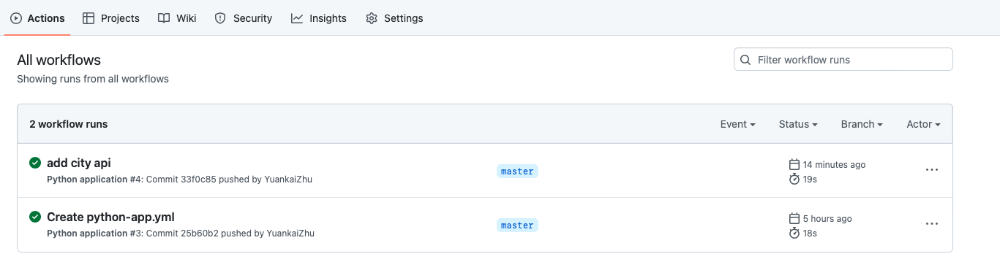
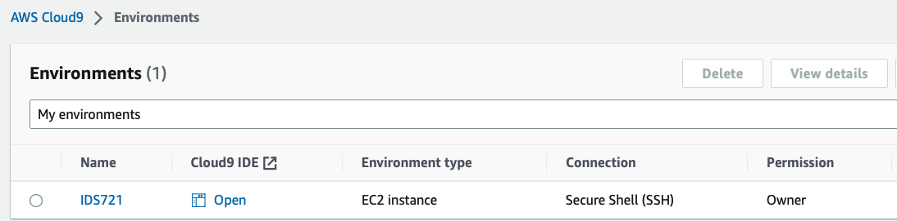

## IDS 721 Project -- Cloud Continuous Delivery of Microservice -- Major City Info Finder

### Brief

In this project, a microservice is deployed for providing information of wanted city including coordinate, belonging country, weather and so on. 

### Feature

* Apply Flask micro-service framework on AWS EC2 Cloud Server

* Apply Github Action as build system to deploy changes

  

* Apply AWS Cloud9 as IaC to deploy code

  
  
* Apply a customized Docker container from the current version of project and deploy it

* Push image to DockerHub https://hub.docker.com/repository/docker/zyk1005505432/cityfinder/general

### Install
1. Pull the image from Docker Hub

2. run sh start.sh to install on local machine

3. run command: docker run -p 5000:80 --name cityfinderrun zyk1005505432/cityfinder

### Usage

1. Get brief introduction of wanted city by inputing URL: http://ec2-34-207-195-21.compute-1.amazonaws.com/city/name. For example:
   * http://ec2-34-207-195-21.compute-1.amazonaws.com/city/durham
     * Durham is located at (latitude, longitude) -78.8664, 36.0335. It is in US. Current local time is Sunday, January 29, 2023 12:56:34. Current weather info: Temperature: 7.43°C, Wind: 2.29, Pressure: 1033, Humidity: 62, Sky: overcast clouds
   * http://ec2-34-207-195-21.compute-1.amazonaws.com/city/beijing
     * Beijing is located at (latitude, longitude) 116.3972, 39.9075. It is in CN. Current local time is Sunday, January 29, 2023 12:58:09. Current weather info: Temperature: 3.94°C, Wind: 3.72, Pressure: 1023, Humidity: 27, Sky: clear sky

2. If there is any space between city name, please replace space with +. For example:
   * http://ec2-34-207-195-21.compute-1.amazonaws.com/city/new+york
     * New York is located at (latitude, longitude) -74.006, 40.7143. It is in US. Current local time is Saturday, February 04, 2023 04:29:01. Current weather info: Temperature: -10.02°C, Wind: 5.66, Pressure: 1038, Humidity: 36, Sky: clear sky
   * http://ec2-34-207-195-21.compute-1.amazonaws.com/city/los+angeles
     * Los Angeles is located at (latitude, longitude) -118.2437, 34.0522. It is in US. Current local time is Saturday, February 04, 2023 04:42:38. Current weather info: Temperature: 13.54°C, Wind: 2.06, Pressure: 1021, Humidity: 52, Sky: clear sky
